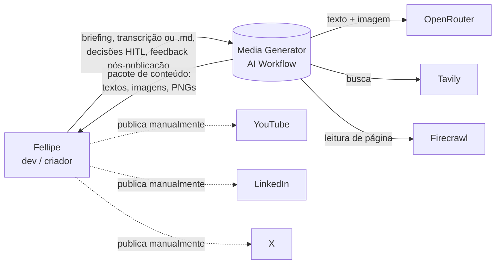
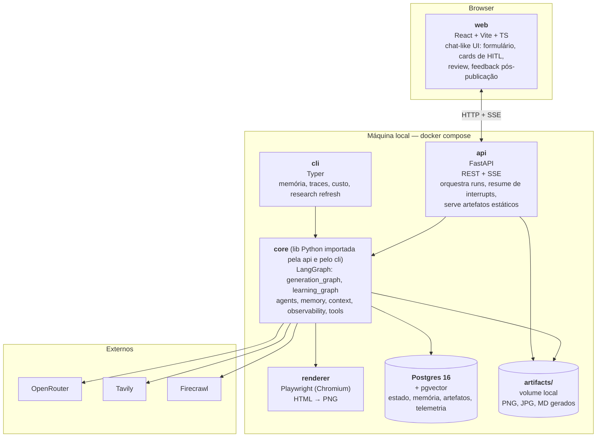
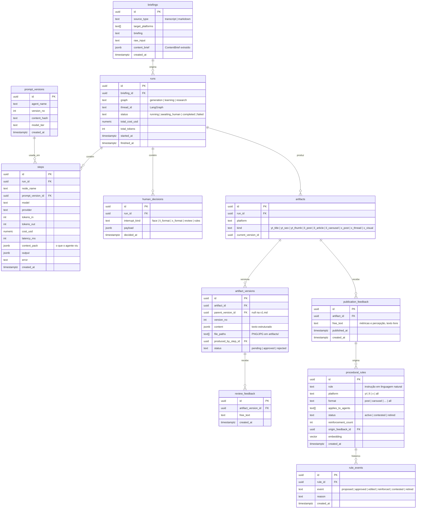

# Media Generator AI Workflow — Arquitetura

> Sistema de agentes com observabilidade total, engenharia de contexto explícita e memória procedural que aprende com revisões humanas e com o resultado real das publicações. Geração de conteúdo para YouTube, LinkedIn e X é o **domínio de exemplo**, não o produto.

Status: v2 — spec fechada em 2026-09-16. Uso pessoal (single-user, local).

---

## 1. Visão de contexto (C4 – nível 1)



Fora do sistema: publicação, agendamento, transcrição automática, vídeo, métricas via API das plataformas (métricas entram como texto livre digitado pelo usuário).

---

## 2. Visão de containers (C4 – nível 2)



| Container | Tecnologia | Responsabilidade | Não faz |
|---|---|---|---|
| `web` | React, Vite, TypeScript, TanStack Query | Formulário de entrada, timeline da run em formato de chat, cards de interrupt (aprovar/rejeitar/editar), tela de review, formulário de feedback pós-publicação | Chat livre, tela de memória, autenticação |
| `api` | FastAPI, Uvicorn, SSE (`sse-starlette`) | Criar/retomar runs, expor eventos do grafo em tempo real, receber decisões HITL, servir artefatos | Lógica de agente (delegada a `core`) |
| `core` | Python 3.12, LangGraph, LangChain, Pydantic v2 | Grafos, agentes, prompts versionados, camadas de memória, montagem de contexto, wrapper de observabilidade, clients de ferramentas | Conhecer HTTP/UI |
| `cli` | Typer, Rich | Inspecionar/editar memória, listar traces e custos, forçar refresh de pesquisa, replay de run | Gerar conteúdo (fase 2, opcional) |
| `renderer` | Playwright + Jinja2 | Renderizar templates HTML (carrossel, code cards) em PNG determinístico | Chamar LLM |
| `Postgres` | 16 + pgvector | Checkpoints LangGraph, memória (3 camadas), briefings, artefatos, versões, telemetria | — |

Um único processo Python roda `api` + `core`; `cli` importa `core` diretamente. Não há filas/workers no MVP — runs são assíncronas via `asyncio` dentro do processo da API, e o checkpointer garante que um restart não perde estado.

---

## 3. Componentes do `core` (C4 – nível 3)

```
core/
├── graphs/
│   ├── generation.py        # generation_graph: ingest → memory → research? → fan-out → review → finalize
│   ├── learning.py          # learning_graph: feedback → learning_agent → HITL regras → memória procedural
│   ├── research.py          # subgrafo de pesquisa (Send por plataforma)
│   ├── youtube.py           # subgrafo YT
│   ├── linkedin.py          # subgrafo LI
│   ├── x.py                 # subgrafo X
│   └── state.py             # TypedDicts/Pydantic do state + reducers
├── agents/
│   ├── base.py              # Agent = prompt_version + model_tier + output_schema + run()
│   ├── ingest.py
│   ├── youtube/{title,seo,thumb_concept}.py
│   ├── linkedin/{strategist,post,article,carousel}.py
│   ├── x/{strategist,writer,visual}.py
│   ├── research/{searcher,synthesizer}.py
│   └── learning.py
├── prompts/                 # versionados: <agent>/<vN>.md com frontmatter (model_tier, changelog)
├── context/
│   ├── brief.py             # ContentBrief (extração + code_blocks[])
│   ├── pack.py              # ContextPack builder: recorte por agente
│   └── policies.py          # o que cada agente PODE ver (allowlist por agente)
├── memory/
│   ├── procedural.py        # regras: CRUD, status (active|contested|retired), aplicabilidade
│   ├── semantic.py          # públicos-alvo (seed) + insights de pesquisa (TTL 14d)
│   ├── episodic.py          # artefatos + feedbacks + métricas; busca por similaridade (pgvector)
│   └── store.py             # adapter sobre langgraph Store + tabelas próprias
├── observability/
│   ├── tracer.py            # decorator/callback: 1 linha em `steps` por nó
│   ├── cost.py              # tabela de preços OpenRouter → custo por chamada
│   └── events.py            # bus interno → SSE
├── tools/
│   ├── openrouter.py        # texto + imagem (único gateway LLM)
│   ├── tavily.py
│   ├── firecrawl.py
│   └── renderer.py          # Playwright HTML→PNG
└── config.py                # model tiers, TTLs, paths, flags
```

### 3.1 Agente (contrato único)

Todo agente é uma instância de `Agent` com:

- `name`, `prompt_version` (arquivo em `prompts/`), `model_tier` (`cheap | image`), `output_schema` (Pydantic).
- `context_policy`: quais chaves do `ContextPack` ele recebe. **Nenhum agente recebe o state inteiro.**
- `run(pack) -> output_schema`. O wrapper de observabilidade envolve esta chamada.

Isso força engenharia de contexto explícita: adicionar um dado ao prompt de um agente exige editar a allowlist dele, e o trace registra exatamente o que entrou.

### 3.2 ContextPack

```python
class ContextPack(BaseModel):
    brief: ContentBrief                     # sempre
    audience: AudienceProfile               # da plataforma-alvo (memória semântica seed)
    rules: list[ProceduralRule]             # só as aplicáveis a (platform, format, agent)
    research: list[ResearchInsight]         # só da plataforma-alvo, não expirados
    episodes: list[Episode]                 # top-k similares (pgvector), com feedback humano
    regen_feedback: RegenFeedback | None    # só em regeneração: versão anterior + texto do usuário
```

O `ContextPack` é serializado no trace de cada step — é possível abrir qualquer step no CLI e ver o contexto exato que gerou aquela saída.

---

## 4. Fluxos principais

### 4.1 Run de geração

```mermaid
sequenceDiagram
    actor U as Usuário
    participant W as web
    participant A as api
    participant G as generation_graph
    participant M as memory
    participant PG as Postgres

    U->>W: briefing + arquivo + source_type + target_platforms
    W->>A: POST /runs
    A->>G: ainvoke(thread_id)
    G->>M: memory_loader → ContextPack por agente
    G->>PG: checkpoint
    G-->>A: eventos (node_start/end, cost)
    A-->>W: SSE
    G->>G: interrupt() (formato LI)
    A-->>W: SSE: awaiting_human {interrupt_id}
    U->>W: aprova / troca formato
    W->>A: POST /runs/{id}/resume {interrupt_id, decision}
    A->>G: Command(resume=decision)
    Note over G: subgrafos LI, X, YT correm em paralelo;<br/>cada interrupt pendente aparece como card
    G->>G: interrupt() (review do pacote)
    U->>W: aprova itens / rejeita com feedback
    alt algum item rejeitado
        G->>G: regen_router → Send só para o nó rejeitado
    else tudo aprovado
        G->>PG: finalize + memória episódica
        G-->>A: run completed
    end
```

### 4.2 Run de aprendizado (pós-publicação)

```mermaid
sequenceDiagram
    actor U as Usuário
    participant W as web
    participant A as api
    participant L as learning_graph
    participant M as memory

    U->>W: feedback texto livre sobre artefato publicado
    W->>A: POST /artifacts/{id}/feedback
    A->>L: ainvoke
    L->>M: grava episódio (métricas em texto)
    L->>L: learning_agent → regras propostas (nova | reforço | contradição)
    L->>L: interrupt() (aprovar regras)
    U->>W: aprova / edita / descarta cada regra
    W->>A: POST /runs/{id}/resume
    L->>M: grava regras aprovadas (active); contradições → regra antiga = contested
    Note over M: regra contested faz o próximo<br/>generation_graph disparar research refresh
```

### 4.3 Research refresh

Disparado no início de uma run de geração quando `semantic.is_stale(platform)` (última pesquisa > 14 dias) **ou** existe regra `contested` para a plataforma. Também via `cli research refresh --platform li`. Três sub-agentes em paralelo (Tavily busca → Firecrawl lê top-N páginas → synthesizer compacta com fonte e data). Saída gravada na memória semântica com TTL.

---

## 5. Modelo de dados (Postgres)



Tabelas adicionais, sem relacionamento forte:

- `semantic_memory` — `kind (audience | research)`, `platform`, `content jsonb`, `sources jsonb`, `embedding vector`, `expires_at`. Seeds de audiência têm `expires_at = null`.
- `episodes` — view materializada sobre `artifact_versions ⋈ review_feedback ⋈ publication_feedback` com `embedding` do conteúdo, usada pelo `episodic.search(brief, k)`.
- `checkpoints`, `checkpoint_writes` — criadas pelo `PostgresSaver` do LangGraph.
- `store` — criada pelo `PostgresStore` do LangGraph (namespace por camada de memória).

---

## 6. API (FastAPI)

| Método | Rota | Descrição |
|---|---|---|
| `POST` | `/runs` | Cria briefing + inicia `generation_graph`. Body: `source_type`, `target_platforms`, `briefing`, arquivo (multipart). Retorna `run_id`. |
| `GET` | `/runs/{id}/events` | SSE: `node_start`, `node_end`, `cost_update`, `awaiting_human`, `artifact_ready`, `completed`, `failed`. |
| `POST` | `/runs/{id}/resume` | Retoma um interrupt. Body: `interrupt_id`, `decision` (schema varia por `interrupt_kind`). |
| `POST` | `/runs/{id}/face` | Upload de foto/frame + flag de consentimento (interrupt `face`). |
| `GET` | `/runs/{id}` | Estado atual, artefatos, custos, interrupts pendentes. |
| `GET` | `/artifacts/{id}` | Artefato + versões. |
| `POST` | `/artifacts/{id}/feedback` | Feedback pós-publicação → inicia `learning_graph`. |
| `GET` | `/artifacts/files/{path}` | Serve PNG/JPG do volume. |
| `GET` | `/runs` | Lista runs com status e custo. |

Sem autenticação (bind em `127.0.0.1`).

---

## 7. Memória — design

| Camada | O que guarda | Quem escreve | Quem lê | Invalidação |
|---|---|---|---|---|
| **Procedural** | Regras de *como fazer* em linguagem natural, com escopo `(platform, format, agents)` | `learning_graph`, só após HITL | `memory_loader` → `ContextPack.rules` | Contradição → `contested`; usuário via CLI → `retired` |
| **Semântica** | Públicos-alvo por plataforma (seed manual) + insights de pesquisa web com fonte | Seed: migration inicial. Pesquisa: `research_graph` | `memory_loader` → `audience`, `research` | TTL 14 dias ou regra `contested` da plataforma |
| **Episódica** | Cada versão de artefato + o que o humano disse dele (review e pós-publicação) | `finalize`, `learning_graph` | `memory_loader` → top-k por similaridade com o `ContentBrief` | Nunca expira; ranking por similaridade e recência |

**Short-term memory** é o state do LangGraph, persistido pelo `PostgresSaver` por `thread_id`. Um run = um thread. Regeneração reutiliza o mesmo thread (mantém o restante do pacote intacto).

**Princípio:** nenhuma regra procedural entra sem aprovação humana. O `learning_agent` propõe; o humano dispõe. Isso evita a memória "inventar" regras a partir de um feedback ambíguo.

**Seleção de regras** no `memory_loader`: filtro exato por `platform ∈ {alvo, all}` e `format ∈ {alvo, all}` e `agent ∈ applies_to_agents`, status `active`, ordenado por `reinforcement_count desc`, limitado a N (config) para não inflar o prompt. Regras `contested` **não** entram no contexto até serem resolvidas.

---

## 8. Observabilidade

Um decorator `@traced(node_name)` envolve cada nó e o `run()` de cada agente. Por chamada grava em `steps`: prompt version (hash do arquivo), modelo/provedor, tokens in/out (do header da resposta OpenRouter), custo (tabela local de preços), latência, `context_pack` completo, saída estruturada, erro se houver. Interrupts gravam em `human_decisions`.

Eventos do mesmo tracer alimentam o bus interno → SSE → UI mostra custo acumulado em tempo real.

CLI:

```
mgw runs list                     # runs, status, custo
mgw runs show <id>                # timeline de steps, custo por nó
mgw steps show <id>               # context_pack + output + prompt usado
mgw memory rules [--platform li] [--status contested]
mgw memory rules retire <id>
mgw memory research show --platform x
mgw research refresh --platform li
mgw cost summary --since 30d      # custo por agente / por modelo
```

Fase 2 (não MVP): exportar `steps` como spans OpenTelemetry para comparar com Langfuse/LangSmith.

---

## 9. Política de modelos e custo

| Uso | Tier | Exemplo (config, não hardcode) |
|---|---|---|
| Ingest, estrategistas, writers, synthesizer, learning | `cheap` | modelo de texto econômico via OpenRouter |
| Thumbnail, capa de artigo, visual X sem código | `image` | modelo de imagem via OpenRouter; **só após HITL** |
| Carrossel, code cards, visual X com código | — | Playwright, custo zero de LLM |
| Pesquisa web | — | Tavily (busca) + Firecrawl (scrape), no máximo a cada 14 dias |

`cost.py` mantém a tabela de preços por modelo; `config.py` mapeia tier → modelo, trocável por env.

---

## 10. Renderer (HTML → PNG)

Templates Jinja2 em `renderer/templates/` (`carousel_slide.html`, `code_card.html`, `x_visual.html`) com a identidade visual do canal como CSS base. O agente de carrossel produz JSON (`slides: [{title, body, code_block_id?}]`); o renderer injeta o bloco de código **original** do `ContentBrief.code_blocks[]` — o LLM nunca reescreve código. Playwright headless renderiza em 1080×1350 (LI) ou 1600×900 (X). PNGs vão para `artifacts/<run_id>/`.

---

## 11. Frontend (React)

Uma única página com três áreas:

1. **Nova run** — formulário: `source_type` (radio), `target_platforms` (checkboxes; YT só habilitado para transcript), briefing (textarea), upload.
2. **Timeline da run** (aparência de chat) — cada evento SSE vira uma mensagem: "ingest concluído", "estrategista LI recomenda carrossel porque…", card de interrupt com botões, artefato pronto com preview, custo acumulado no rodapé.
3. **Review** — grid de artefatos; por item: aprovar / rejeitar + textarea de feedback. Enviar → resume.
4. **Feedback pós-publicação** — lista de artefatos aprovados; textarea por artefato → inicia `learning_graph`; cards de regras propostas com aprovar/editar/descartar.

Sem roteamento complexo, sem estado global além do TanStack Query.

---

## 12. Estrutura de repositório

```
media-generator-ai-workflow/
├── ARCHITECTURE.md
├── docker-compose.yml           # postgres+pgvector, api, web
├── .env.example                 # OPENROUTER_API_KEY, TAVILY_API_KEY, FIRECRAWL_API_KEY, DATABASE_URL
├── backend/
│   ├── pyproject.toml           # uv
│   ├── core/                    # ver §3
│   ├── api/                     # FastAPI: routers, sse, schemas
│   ├── cli/                     # Typer
│   ├── renderer/                # templates + playwright
│   ├── migrations/              # alembic (+ seed de audiência)
│   └── tests/
│       ├── unit/                # agentes com LLM mockado, context policies, memory selection
│       ├── graph/               # grafos com interrupt/resume em MemorySaver
│       └── eval/                # datasets de regressão por agente (fase 2)
├── web/
│   ├── package.json
│   └── src/
│       ├── api/                 # client + SSE hook
│       ├── components/          # RunForm, Timeline, InterruptCard, ReviewGrid, FeedbackForm
│       └── pages/
└── artifacts/                   # volume, gitignored
```

---

## 13. Decisões de arquitetura (ADR resumido)

| # | Decisão | Alternativa rejeitada | Motivo |
|---|---|---|---|
| 1 | Dois grafos (`generation`, `learning`) ligados só pelo Postgres | Um grafo com nó terminal de aprendizado | Aprendizado acontece dias depois, em evento do usuário; não deve segurar checkpoint da run |
| 2 | `ContextPack` com allowlist por agente | Passar o state inteiro | Torna engenharia de contexto auditável; trace mostra exatamente o que cada agente viu |
| 3 | Regras procedurais só entram após HITL | Gravação automática + auditoria posterior | Evita regras alucinadas; custo de um clique por regra é aceitável para single-user |
| 4 | Contradição → `contested`, não delete | Sobrescrever regra | Um feedback isolado não deve apagar aprendizado acumulado; re-pesquisa resolve |
| 5 | Pesquisa web cacheada com TTL 14d | Pesquisar a cada run | Fonte fraca e ruidosa; custo e latência não justificam |
| 6 | Código → PNG via Playwright | Modelo de imagem | Fidelidade de caracteres e custo zero |
| 7 | Observabilidade própria em Postgres primeiro | LangSmith/Langfuse desde o início | Objetivo de aprendizado; comparação com ferramentas prontas vem na fase 2 |
| 8 | `target_platforms` escolhido pelo usuário, mas como campo do state | Estrategista de plataforma | Menos LLM no MVP; adicionar estrategista depois é só um nó que preenche o mesmo campo |
| 9 | Sem fila/worker | Celery/Arq | Single-user local; checkpointer cobre restart |
| 10 | Vídeo fora do MVP | Geração via OpenRouter | Item mais caro e menos alinhado ao objetivo (memória/observabilidade) |

---

## 14. Fases de entrega

> A UI é a última entrega de agente do MVP. Ela desenha estado que já existe; não pode preceder a memória que precisa exibir. Ordem canônica em `docs/spec/v1.md` §"Ordem de construção".

1. **Fundação + um agente completo** — Postgres + migrations, `Agent` base, tracer, `ContextPack`, `memory_loader` com seeds, CLI básico. Um grafo linear único: `ingest_context` → `memory_loader` → `li_strategist` (interrupt) → `li_post_agent` → review (interrupt) → `finalize` → memória episódica, **já com o loop de regeneração real** (`regen_targets` no state). Sem UI (CLI dispara run e responde interrupts).
2. **Aprendizado** — `learning_graph`, regras procedurais com HITL, contradição → `contested`, `episodic.search`. *Aqui o projeto passa a ser diferente de um chat.*
3. **Demais agentes e plataformas** — LI completo (artigo, carrossel + Playwright), X, YT (+ imagem OpenRouter + HITL de foto) e, por último, o fan-out paralelo real com múltiplos interrupts e resume por ID.
4. **Pesquisa** — research subgraph com `create_agent`, TTL 14d, contestação → refresh.
5. **UI** — React + SSE, cards de interrupt, review, feedback pós-publicação.
6. **Fase 2** — evals por agente, OpenTelemetry, estrategista de plataformas, tela de memória.
