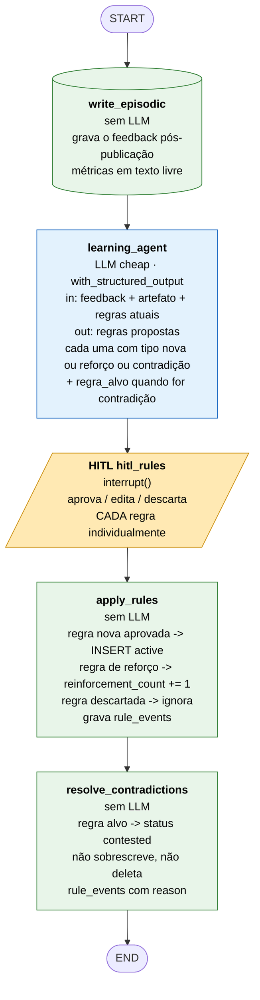

# LangGraph — grafos, state e regras de implementação (v1)

Companheiro de `LANGGRAPH_NODES_V1.mermaid` (que mostra o `generation_graph`).
Aqui ficam: o `learning_graph`, o schema de state e — o mais importante — as regras de
LangGraph que o desenho **assume**. Se uma dessas regras for ignorada na implementação,
o grafo quebra (deadlock, execução dupla ou `regen` que não regenera nada).

Status: v1 — 2026-09-17. Substitui o diagrama anterior, que continha arestas
não-executáveis (ver §6).

---

## 1. Os dois grafos

| Grafo | Onde vive | Disparo | Ciclo de vida |
|---|---|---|---|
| `generation_graph` | `core/graphs/generation.py` | `POST /runs` (ou CLI) | Segundos a minutos; 1 run = 1 thread |
| `learning_graph` | `core/graphs/learning.py` | `POST /artifacts/{id}/feedback` | Dias depois; thread própria |

Os dois **não se chamam**. A única ligação é o Postgres: `learning_graph` grava
`procedural_rules` e sinaliza `contested`; o `generation_graph` lê isso no
`memory_loader` na próxima run. Isso é uma decisão consciente (ADR 1) e **não** uma
aresta de grafo.

---

## 2. `learning_graph`



O ponto de extensão "regra `contested` dispara pesquisa na run seguinte" **não é uma
aresta** — é o `NEEDS` do `generation_graph` lendo `procedural_rules.status` no
`memory_loader`.

---

## 3. State do `generation_graph`

Um único `TypedDict` (ou Pydantic) em `core/graphs/state.py`. Campos e reducers:

| Campo | Tipo | Reducer | Por quê |
|---|---|---|---|
| `run_id`, `briefing_id` | `str` | — | identidade da run |
| `source_type` | `Literal["transcript", "markdown"]` | — | YT só existe com transcript |
| `target_platforms` | `list[str]` | — | alvo da run |
| `briefing` | `str` | — | briefing livre do usuário |
| `raw_input` | `str` | — | arquivo bruto |
| `content_brief` | `ContentBrief` | — | saída do `ingest_context` |
| `semantic_refresh` | `set[str]` | `operator.or_` | plataformas marcadas stale no `r_entry` |
| `wave` | `Literal["fresh", "regen"]` | last-value | setado por `platform_dispatch` / `regen_dispatch` |
| `regen_targets` | `dict[str, list[str]]` | `merge_dict` | plataforma → artefatos a regenerar |
| `artifacts` | `dict[str, ArtifactState]` | **`merge_dict`** | **obrigatório**: 3 subgrafos escrevem em paralelo |
| `review` | `dict[str, ReviewDecision]` | `merge_dict` | decisão por item no `REVIEW_GATE` |
| `human_face` | `FaceInput \| None` | last-value | foto/frame + consentimento |

Duas armadilhas concretas:

1. **Sem reducer, escrita concorrente estoura.** `yt_graph`, `li_graph` e `x_graph`
   escrevem em `artifacts` no mesmo superstep. Sem
   `Annotated[dict[str, ArtifactState], merge_dict]` o LangGraph levanta
   `InvalidUpdateError`. Vale para qualquer chave compartilhada entre os 3.
2. **`regen_targets` e `wave` precisam ser limpos.** No fim de cada wave de regen,
   volte `wave="fresh"` e `regen_targets={}`, senão a próxima passagem volta a
   regenerar o item antigo.

---

## 4. Regras de LangGraph que o desenho assume

### 4.1 Um nó = uma chamada de modelo

Todo nó marcado `LLM` faz **exatamente uma** chamada (via
`init_chat_model(...).with_structured_output(Schema)`). É isso que permite que a
tabela `steps` tenha 1 linha por nó com tokens, custo e `context_pack` exatos — que é
o produto real do projeto (ADR 7). Se um nó virar loop de tool, essa granularidade
se perde.

### 4.2 Fan-out paralelo

Plataformas são um conjunto **estático** (máx. 3) conhecido em tempo de compilação.
Portanto: **não use `Send`** aqui. Use três arestas separadas saindo do mesmo nó.

```python
builder.add_edge("platform_dispatch", "yt_graph")
builder.add_edge("platform_dispatch", "li_graph")
builder.add_edge("platform_dispatch", "x_graph")
```

`Send` é para fan-out **dinâmico** (N itens desconhecidos), que não é o caso.

### 4.3 Fan-in: barreira vs. aresta individual

Esta é a distinção que mais importa no desenho:

```python
# BARREIRA: só dispara quando os 3 escreverem
builder.add_edge(["yt_graph", "li_graph", "x_graph"], "review_gate")

# ARESTA INDIVIDUAL: dispara quando qualquer um escrever
builder.add_edge("yt_graph", "review_gate")
```

`add_edge` com **lista** cria um canal `NamedBarrierValue` (confirmado em
`langgraph/graph/state.py::attach_edge`). Com **string única**, cria aresta simples.

Regra prática:

- **Barreira** só onde *todos* os ramos rodam sempre na mesma wave.
  `REVIEW_GATE` e `yt_join` e `r_synth` são esses casos.
- **Aresta individual** onde os ramos são mutuamente exclusivos por wave
  (entrada de um subgrafo vindo de `platform_dispatch` **e** de `regen_dispatch`).
- **Nunca** coloque barreira em cima de ramo que pode não rodar — dá deadlock.

### 4.4 Por que os 3 subgrafos são re-entrados em toda wave

`REVIEW_GATE` é uma barreira sobre `[yt_graph, li_graph, x_graph]`. Se na regen você
re-entrasse **só** no `li_graph`, a barreira nunca seria satisfeita e o grafo
travaria.

Por isso `regen_dispatch` (e `platform_dispatch`) sempre apontam para **os três**
subgrafos. Quem não tem trabalho sai pelo **entry router no-op**:

```python
def yt_entry(state) -> str:
    if "yt" not in state["target_platforms"]:
        return "yt_exit"                        # no-op: só devolve o write
    if state["regen_targets"].get("yt"):
        return regen_target_for(state)          # yt_title | yt_seo | yt_thumb
    return "yt_fanout"                          # wave fresh
```

Um nó no-op **completa** e escreve no canal da barreira. É isso que mantém o fan-in
correto em todos os cenários (fresh com 3 plataformas, regen de 1, `.md` sem YT).

### 4.5 Regen é ciclo, não aresta

O caminho `REVIEW_GATE → regen_dispatch → subgrafos → REVIEW_GATE` é um **ciclo**
válido. O item rejeitado não é regenerado por uma aresta pontilhada mágica — ele é
regenerado porque `regen_targets` no state faz o entry router do subgrafo desviar
direto para o nó gerador daquele artefato, e o `yt_join` / `li_exit` da regen **não**
passa pela barreira.

Efeitos colaterais:

- Aumente `recursion_limit` (ex.: 100) no `config` da invocação.
- `regen_dispatch` deve sempre reescrever `regen_targets` do zero, não acumular.

### 4.6 Interrupts em paralelo: resume por ID

LI e X podem interromper ao mesmo tempo (e a face do YT junto). Isso gera **múltiplos
`Interrupt` pendentes**. O resume é um mapa por ID:

```python
resume_map = {i.id: decision_for(i) for i in pending_interrupts}
graph.invoke(Command(resume=resume_map), config)
```

É exatamente por isso que a API tem `POST /runs/{id}/resume { interrupt_id, decision }`
e não um `resume` global. Mantenha esse contrato.

### 4.7 `interrupt()` é do nó, não de middleware

Os gates do projeto são **decisões de negócio** (formato LI, formato X, review do
pacote, regras aprendidas) — não aprovação de tool call. Use `interrupt()` explícito
dentro do nó, nunca `HumanInTheLoopMiddleware`.

Gotcha: um nó que chama `interrupt()` **re-executa desde o início** no resume.
Portanto: `interrupt()` **primeiro**, efeitos colaterais **depois**. Efeitos antes do
interrupt acontecem duas vezes.

### 4.8 Subgrafo é um nó

- `research_graph`, `yt_graph`, `li_graph`, `x_graph` são `StateGraph` compilados e
  adicionados como nó no pai.
- Arestas do pai apontam para o **id do subgrafo**, nunca para nós internos. (O
  diagrama antigo violava isso.)
- Um subgrafo invocado por aresta **sempre** começa no seu `START`; por isso o entry
  router existe.
- Compile com `checkpointer=False` nos subgrafos — quem persiste é o grafo pai.

### 4.9 `create_agent` (LangChain) só onde há tool loop

| Nó | Implementação |
|---|---|
| `research_yt` / `research_li` / `research_x` | `create_agent` com tools Tavily + Firecrawl |
| todos os outros (~18 nós) | função pura + `init_chat_model().with_structured_output()` |

Não use `SubAgentMiddleware` como orquestração. Subagente é delegação *dentro* de um
loop de agente; o fan-out por plataforma é aresta paralela com portão humano. Se algum
dia um nó precisar de loop de tool, promova **aquele nó** a um grafo compilado com
`create_agent` e embuta como subgrafo.

### 4.10 Checkpoint

1 run = 1 `thread_id` no `PostgresSaver`. A regen **reusa a mesma thread** — é o que
mantém os outros itens do pacote intactos enquanto só um é regenerado.

---

## 5. Contratos de nó (resumo)

Todo nó declara, no header do arquivo e no `@traced(node_name)`:

| Coluna | Significado |
|---|---|
| `node` | nome no grafo (= `steps.node_name`) |
| `model_tier` | `none` (sem LLM), `cheap`, `image` |
| `reads` | chaves do state que o nó **pode** ler |
| `writes` | chaves do state que o nó **pode** escrever |
| `interrupt` | `sim` / `não` — se `sim`, entra em `human_decisions` |
| `idempotente` | `sim` se pode re-executar no resume sem duplicar efeito |

O `reads`/`writes` é o que torna o `ContextPack` auditável na prática: um agente só
recebe o que está na allowlist dele, e o trace grava exatamente esse recorte.

---

## 6. Correções em relação ao diagrama anterior

| # | Antes | Agora | Por quê |
|---|---|---|---|
| 1 | `FANOUT` com `Send` por plataforma | 3 arestas paralelas estáticas | Plataformas são conjunto fixo; `Send` é para fan-out dinâmico |
| 2 | Nós de plataforma → `REVIEW` como setas independentes | **barreira** `add_edge([...], REVIEW_GATE)` | Garante que o review só abre com os 3 concluídos |
| 3 | `REGEN` → nós internos (`YT_T`, `LI_R`, `X_R`) | `REGEN` → **ids dos subgrafos**, com entry router | Não existe aresta cruzando fronteira de subgrafo |
| 4 | `REGEN -.-> ` só o item | `regen_targets` no state + entry router no-op | É o mecanismo real; o diagrama antigo não era executável |
| 5 | `H_FACE` dentro do fan-out, antes do join | face gate **depois** do join dos 3 conceitos | Evita ramo de profundidade diferente na barreira |
| 6 | `MARK -.-> STALE` como aresta | flag no Postgres lida no `memory_loader` | Grafos separados não compartilham aresta |
| 7 | `OBS` desenhado como nó | `@traced` é wrapper, não nó | Não aparece no grafo nem no `steps` como nó próprio |
| 8 | `UI` e `CLI` como nós do grafo | fora do grafo | São clientes da API, não etapas de execução |
| 9 | Um `UI` antes de tudo na ordem de construção | UI por último | Ver `../spec/v1.md` — a memória tem que estar provada antes |

---

## 7. Ordem de construção

Ver `../spec/v1.md` §"Ordem de construção". Resumo: **fundação + 1 agente completo
ponta a ponta (sem UI) → aprendizado com regras → demais agentes e plataformas →
pesquisa web → UI → fase 2.**
